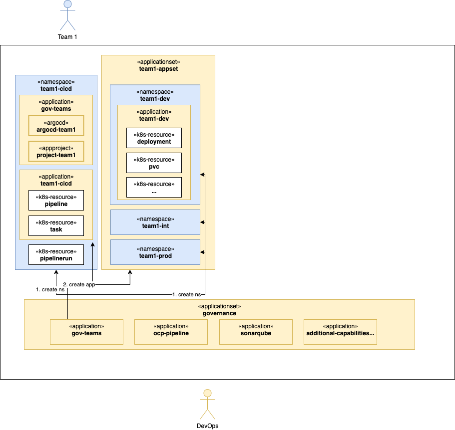
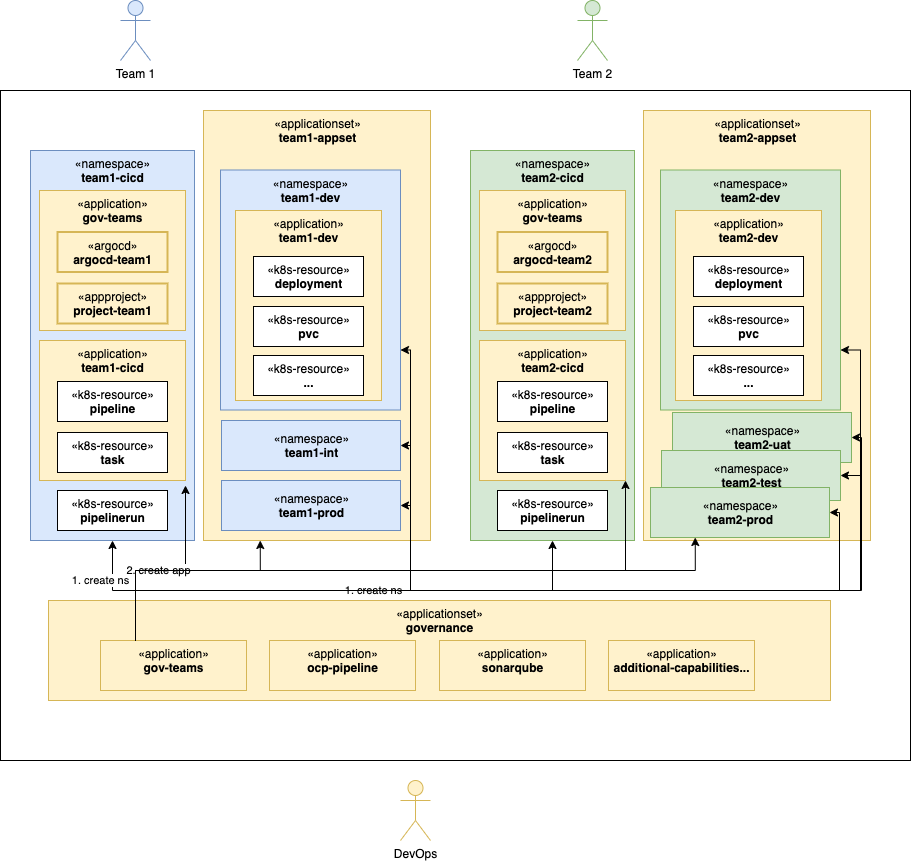
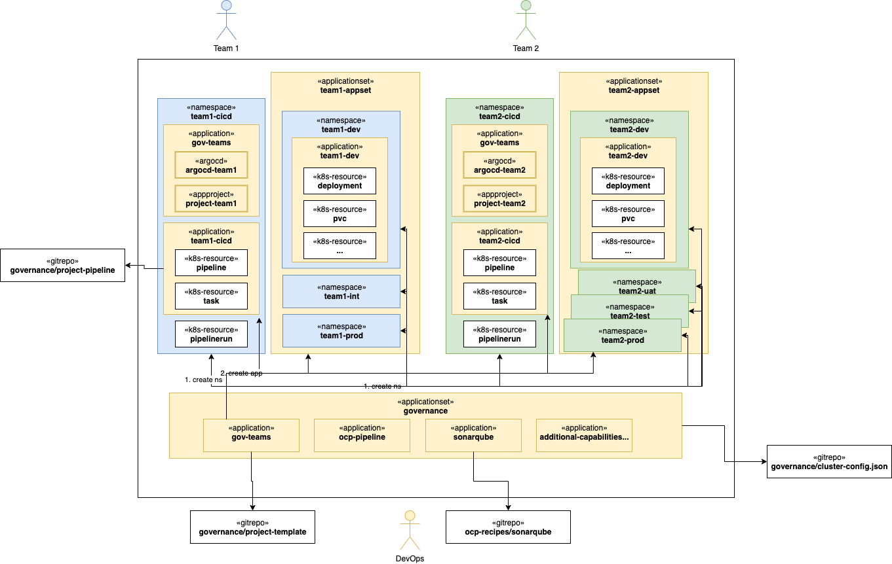

= GitOps - Governance
:author: Hafid Haddouti
:toc: macro
:toclevels: 4
:sectlinks:
:sectanchors:

GitOps. 

toc::[]

== Overview

This projects represents the main IT architecture/governance configuration for managing a cluster for various teams with different Kubernetes/OpenShift capabilities. Using the GitOps approach.

It use primarily link:https://docs.openshift.com/container-platform/4.8/cicd/gitops/understanding-openshift-gitops.html[OpenShift GitOps] which includes link:https://argo-cd.readthedocs.io/en/stable/[ArgoCD].

The main objective is, to have one place for managing the Kubernetes/OpenShift cluster the GitOps way. This includes the following use cases

* bootstrap the existing cluster with main/base capabilities like Pipeline support, Secrets Management or similar
* manage the teams and apps which includes the namespaces and corresponding pipeline configurations
* all other IT architecture and governance related policies

All use cases (features/capabilities) will be handled with OpenShift GitOps/ArgoCD. This allows for flexible modification and expansion of the capabilities.

This construct contains the following components

* link:governance[]: the bootstrap configuration 
* link:governance/cluster-configs.json[]: the cluster configuration 
* link:argocd-project-template[]: the ArgoCD configuration which will be applied for the teams/apps

The initial bootstrap will be started with applying the Kubernetes manifest files from link:governance[]. This installs the OpenShift GitOps operator if necessary and register a new ArgoCD `ApplicationSet` listening on the link:governance/cluster-configs.json[], which contains the configuration for all the wanted applications and cluster capabilities (like Operators, SonarQube or similar).

This approach allows a very simple extension of the capabilities (aka ArgoCD applications).

In <<Img1>> we see the relationship of the main components (ArgoCD and Kubernetes resources) for one team/project.

[[Img1, Figure 1]]

The `governance` `ApplicationSet` holds all common applications, including the `gov-teams` which represents the configuration for all teams/projects.
Every team receives 

* a `cicd` namespace holding the Tekton resources,
* the environment related namespaces (e.g. for test, int, prod)
* and ArgoCD `Applications` managing the resources in the dedicated namespaces

The configuration for a team/project is defined in link:argocd-project-template/values.yaml[]. Relevant are the main attributes for

* Git configuration (repo, revision)
* name of the `config.json` 
* the individual namespaces

Any team has the same structure, see <<Img2>>.

[[Img2, Figure 2]]

And <<Img3>> give an impression about the relationship to the git repositories.

[[Img3, Figure 3]]

== GitOps Features

This chapters list all the available features in this setup

* uses ArgoCD for the cluster configuration reconciliation 
* manages all capabilities in a JSON file which is the base for `ApplicationSet`
* creates for any team/project an own `ArgoCD` and `Project` instance
* bound git repo of the team to the ArgoCD Project instance for more/better multi-tenant restriction
* define policies and groups which can be used to access the ArgoCD resources
* creates a project structure in OpenShift with predefined namespaces + an additional namespace for all the pipeline resources
* configures ArgoCD to exclude `PipelineRun` and `TaskRun`, this allows to manually execute/run such runs (for testing)
* Optimize ArgoCD and enable only selective synchronization (out-of-sync) instead always all resources
* enable Prometheus monitoring for the ArgoCD resources

== Usage

.Initialize
----
$ helm template gov governance --output-dir=work/gov

$ oc apply -f work/gov/argocd/templates
----

== Summary

GitOps and IT-Governance to manage a Kubernetes/OpenShift cluster for various teams and capabilities. 

== References

* ArgoCD - link:https://argo-cd.readthedocs.io/en/stable/[]
* Managing GitOps control planes for secure GitOps practices - link:https://developers.redhat.com/articles/2021/08/03/managing-gitops-control-planes-secure-gitops-practices[]

== Open

N/A

== License

This article is licensed under the Apache License, Version 2.
Separate third-party code objects invoked within this code pattern are licensed by their respective providers pursuant
to their own separate licenses. Contributions are subject to the
link:https://developercertificate.org/[Developer Certificate of Origin, Version 1.1] and the
link:https://www.apache.org/licenses/LICENSE-2.0.txt[Apache License, Version 2].

See also link:https://www.apache.org/foundation/license-faq.html#WhatDoesItMEAN[Apache License FAQ]
.
