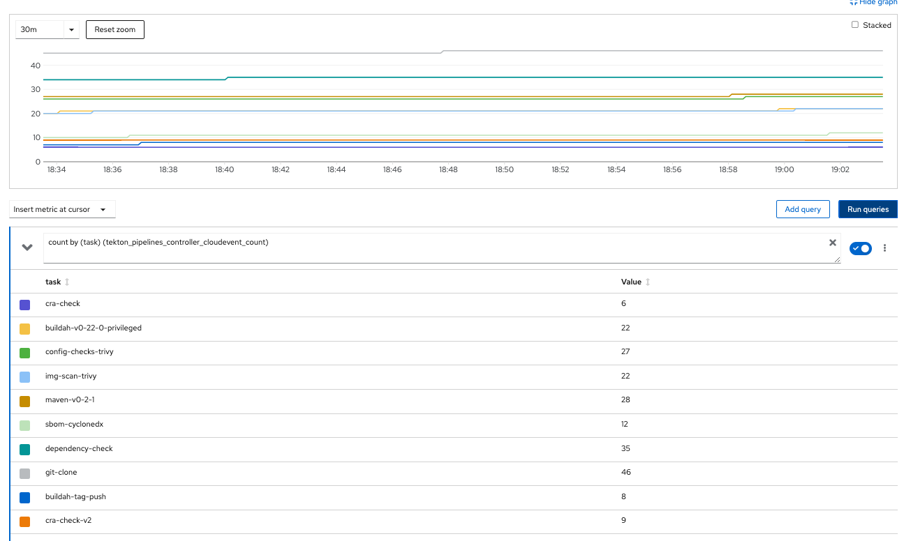
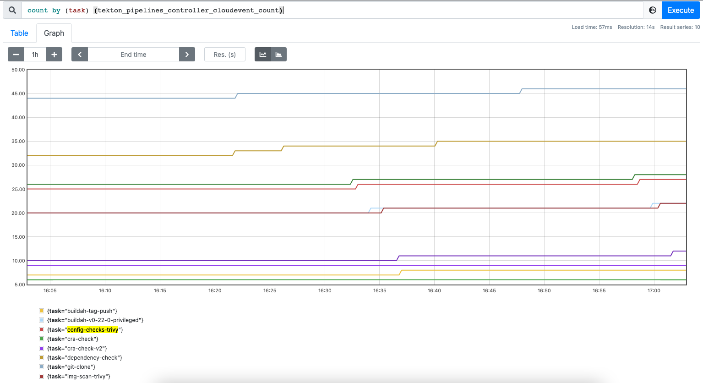

= GitOps - Governance
:author: Hafid Haddouti
:toc: macro
:toclevels: 4
:sectlinks:
:sectanchors:

GitOps. 

toc::[]

== Overview

This projects represents the main IT architecture/governance configuration for managing a cluster for various teams with different Kubernetes/OpenShift capabilities. Using the GitOps approach.

It uses primarily link:https://docs.openshift.com/container-platform/4.8/cicd/gitops/understanding-openshift-gitops.html[OpenShift GitOps] which includes link:https://argo-cd.readthedocs.io/en/stable/[ArgoCD].

The main objective is, to have one place for managing the Kubernetes/OpenShift cluster the GitOps way. This includes the following use cases

* *bootstrap* the existing cluster with main/base *capabilities* like Pipeline support, Secrets Management or similar
* *manage* the teams and apps which includes the namespaces and corresponding pipeline configurations
* *governance* all other IT architecture and governance related policies

All use cases (features/capabilities) will be handled with OpenShift GitOps/ArgoCD. This allows flexible modification and expansion of the capabilities.

This solution contains the following components

* link:gitops-bootstrap[]: the bootstrap definition to install ArgoCD and configure the foundation 
* link:governance/cluster-configs.json[]: the cluster configuration 
* link:argocd-project-template[]: the standardized project template as ArgoCD configuration which will be applied for the teams/apps
* link:tekton[]: Base Tekton task and pipeline definitions

The initial bootstrap will be started with applying the Kubernetes manifest files from link:gitops-bootstrap[]. This installs the OpenShift GitOps operator if necessary and register a new ArgoCD `ApplicationSet` listening on the link:governance/cluster-configs.json[], which contains the configuration for all the cluster capabilities (like Operators, SonarQube or similar) and to maintained applications.

This approach allows a very simple extension of the capabilities (aka ArgoCD applications).

In <<Img1>> we see the relationship of the main components (ArgoCD and Kubernetes resources) for one team/project.

[[Img1, Figure 1]]
image:static/gitops-overview.png[]

The `governance` `ApplicationSet` holds all common applications, including the `gov-teams` which represents the configuration for all teams/projects.
Every team receives 

* a `cicd` namespace holding the Tekton resources,
* the environment related namespaces (e.g. for test, int, prod)
* and ArgoCD `Applications` managing the resources in the dedicated namespaces

The configuration for a team/project is defined in link:argocd-project-template/values.yaml[]. Relevant are the main attributes for

* Git configuration (repo, revision)
* name of the `config.json` 
* the individual namespaces

Any team has the same structure, see <<Img2>>.

[[Img2, Figure 2]]
image:static/gitops-overview-2nd.png[]

And <<Img3>> give an impression about the relationship to the git repositories.

[[Img3, Figure 3]]
image:static/gitops-overview-all.png[]

== GitOps Features

This chapters list all the available features in this setup

.ArgoCD related
* uses ArgoCD for the cluster configuration reconciliation 
* manages all cluster capabilities in a JSON file which is the base for a `ApplicationSet`
* creates for any team/project an own `ArgoCD` and `Project` instance and allows the possibility to manage resources and namespaces outside the default `ArgoCD` instance in `openshift-gitops`
* bound git repo of the team to the ArgoCD Project instance for more/better multi-tenant restriction
* define ArgoCD policies which limit the access to the ArgoCD resources
* define OpenShift Groups which can be used to link users to ArgoCD policy groups
* configures ArgoCD to exclude `PipelineRun` and `TaskRun`, this allows to manually execute/run such runs (for testing)
* Optimize ArgoCD and enable only selective synchronization (out-of-sync) instead always all resources
* Label all namespaces

.OpenShift/cluster related
* creates a project structure in OpenShift with predefined namespaces + an additional namespace for all the pipeline resources
* enable Prometheus monitoring for the ArgoCD resources and expose ArgoCD and Tekton metrics

.Tekton/Pipeline related
* provides Tekton configuration and cluster-wide ``Task``s and ``ClusterRole``s 
* provide project-specific `Pipeline`, `TriggerTemplate`, `TriggerBinding` definitions
* Provide a base CI/CD Pipeline handling main aspects of a secured supply chain, including 
** configuration check (vulnerability and infra) with Trivy
** image scan with Trivy
** SBOM generation and validation with CycloneDX
** dependency check with OWASP Dependency-Check
** image vulnerability check with IBM Cloud Container Registry VA
** SonarQube scan and push remote to SonarQube instance
** tag and push to a remoate/additional container registry
** promote version in a specific Helm value file and push back to git
* Provide SonarQube token for uploading report with help of `ClusterExternalSecret`

=== Metrics

Prometheus metrics are enabled where possible. This allows e.g. to get details about the Tekton executions, durations etc based on the exposed link:https://tekton.dev/docs/pipelines/metrics/[Tekton metrics]. Result is e.g. for the metric `tekton_pipelines_controller_cloudevent_count`

=== Secrets

For secrets management, have a look at link:https://github.com/ocp-universe/kubernetes-secrets-101[Kubernetes Secrets 101].
link:https://github.com/external-secrets/external-secrets[`external-secrets`] is primarily used. This expects an `ExternalSecret` CR, holding information about a secret (ID) and how to map this to a `Secret`. The secret (ID) will be used to retrieve the details from a (managed) Secrets Manager (IBM Cloud Secrets Manager, HashiCorp Vault etc).

In this scenario is a `ClusterExternalSecret` responsible to distribute the same SonarQube Token to all cicd namespaces. `ClusterExternalSecret` uses `namespaceSelector` to identify the relevant namespaces and applies an `ExternalSecret` to retrieve the secret.

== Usage

.Initialize
----
$ helm template gov gitops-bootstrap --output-dir=work/gov -f gitops-bootstrap/values.<...>.yaml

$ oc apply -f work/gov/argocd/templates
----

Rest only via modification of the manifest files in the directory. E.g.

* adding new teams/project => link:argocd-project-template/values.yaml[]
* add a new capability to the cluster (e.g. HashiCorp Vault instance) => link:governance/cluster-configs.json[]
* Enhance/Fix Tekton pipeline definitions => link:tekton[]
* Set NetworkPolicies for all projects, but transparent from the dev teams => link:argocd-project-template[]

== Open Points

still known open points

* [x] Provide Git secrets/authentication for private repository
** [x] link:https://tekton.dev/vault/pipelines-v0.14.3/auth/#exposing-credentials[Tekon docu] for expected `Secrets` => `ClusterExternalSecret` (`eso-global-gh`)
** [x] link `Secret` to `ServiceAccount` => Solved with link of `Secret` with `ssh-key-github` in `ServiceAccount` resource definition
* [ ] For OpenShift and very restricted configurations additional `privileged` permissions needed
** [ ] `oc adm policy add-scc-to-user privileged system:serviceaccount:demo-quarkus-cicd:pipeline` or extend `ClusterRoleBinding` `system:openshift:scc:privileged`
* [x] Create credentials for external CR push referenced in task `buildah-tag-push`
** [x] `Secret` currently named `external-cr-push-secret` contains API key => `ClusterExternalSecret` (`eso-global-apikey`)
* [ ] Create SonarQube token for the sonar-scanner
** [ ] Token in SonarQube
** [x] Store token in a `Secret` => `ClusterExternalSecret` (`eso-global-sonarqube`)
* [ ] `TektonConfig` adjustments like `schedule` to prune resource objects, by default is this not configured
* [ ] GitHub Webhook registration
** [ ] Retrieve created `Route` from the `cicd` namespace of the app and register it in GitHub for the repo as 

== Known Issues

=== Tekton: `when` and dependent Tasks

Before Pipeline v0.27 is the behavior that a not only the current task, but also the dependent tasks will be skipped.
link:https://github.com/tektoncd/pipeline/pull/4085[TEP-0059: Skipping Strategies] change this behavior from Pipeline v0.27.

The workaround in the version before is to handle the check inside the `Step` definition. Means however this will spawn a container, make the check, and in "worst-case" stop immediately.

.Reference
* link:https://tekton.dev/docs/pipelines/pipelines/#guarding-a-task-and-its-dependent-tasks[Tekton docu: guarding and dependent tasks]

== Summary

GitOps and IT-Governance to manage a Kubernetes/OpenShift cluster for various teams and capabilities. 

== References

* ArgoCD - link:https://argo-cd.readthedocs.io/en/stable/[]
* Managing GitOps control planes for secure GitOps practices - link:https://developers.redhat.com/articles/2021/08/03/managing-gitops-control-planes-secure-gitops-practices[]

== Open

N/A

== License

This article is licensed under the Apache License, Version 2.
Separate third-party code objects invoked within this code pattern are licensed by their respective providers pursuant
to their own separate licenses. Contributions are subject to the
link:https://developercertificate.org/[Developer Certificate of Origin, Version 1.1] and the
link:https://www.apache.org/licenses/LICENSE-2.0.txt[Apache License, Version 2].

See also link:https://www.apache.org/foundation/license-faq.html#WhatDoesItMEAN[Apache License FAQ]
.